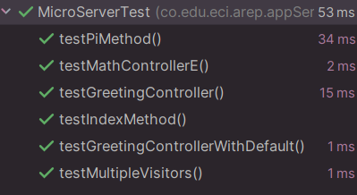

# Microframework para Servicios REST en Java

Este proyecto es un microframework en Java que permite la creación de servicios REST utilizando anotaciones personalizadas como @RestController, @GetMapping y @RequestParam. El framework explora automáticamente el classpath en busca de clases anotadas con @RestController y expone sus métodos mapeados con @GetMapping como endpoints accesibles desde un navegador o cliente HTTP.

## Requisitos Previos

Para ejecutar este proyecto, se necesita:

- Java 8+ – Lenguaje de programación
- Maven – Gestión de dependencias

## Instalación

Sigue estos pasos para configurar y ejecutar el microframework:

1. Clonar el repositorio

```bash
git clone https://github.com/Andrea2511/AREP_Taller3.git
cd tu-repositorio
```

2. Compilar el proyecto con Maven

```bash
mvn clean install
```

3. Ejecutar el servidor

Ejecuta el servidor especificando la clase con los controladores REST:

```bash
java -cp target/classes co.edu.eci.arep.appServer.MicroServer
```

## Anotaciones Implementadas
El framework utiliza anotaciones personalizadas para definir controladores y rutas:

- **@RestController:** Marca una clase como un controlador REST.
- **@GetMapping("/ruta"):** Define una ruta GET en un método del controlador.
- **@RequestParam(value="param", defaultValue="valor"):** Define un parámetro de consulta en la URL.

## Explicación Detallada del Código

1. **MicroServer.java:** Servidor principal que carga controladores y maneja rutas, responsable de descubrir y cargar controladores, además de manejar solicitudes HTTP.


2. **GetMapping.java:** Anotación para rutas, esta anotación personalizada se usa para definir qué métodos responderán a solicitudes GET en el servidor.


3. **RestController.java:** Anotación para controladores, permite marcar una clase como controlador REST.


4. **RequestParam.java:** Anotación para parámetros en la URL, esta anotación permite definir parámetros de consulta en las rutas.


5. **GreetingController.java:** Controlador de ejemplo, define un endpoint /greeting que responde con un saludo personalizado.


6. **MathController.java:** Controlador matemático, define operaciones matemáticas como e y pi.


## Ejecutando las pruebas

Para ejecutar las pruebas, usa:

```bash
mvn test
```



Esto verificará el correcto funcionamiento del servidor y el mapeo de rutas.

## Construido con

Java – Lenguaje de programación
Maven – Gestión de dependencias


## Versionado

1.0.1

## Autor

Andrea Valentina Torres Tobar
